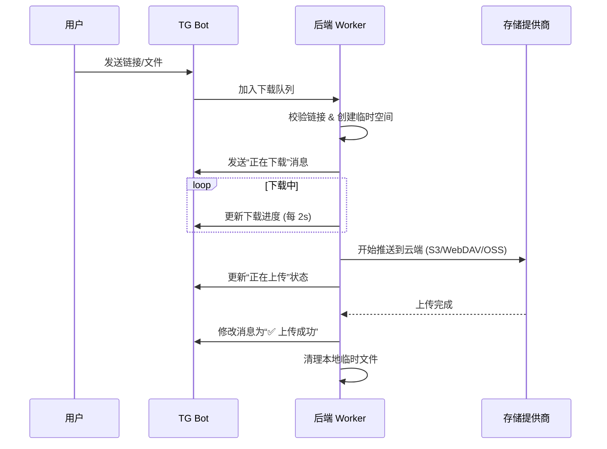

# Telegram Bot 逻辑解析 🤖

FoomClous 的 Telegram 机器人不仅是上传入口，更是一个全自动化的文件流转引擎。它具备多任务并行、实时状态同步及完善的防洪保护机制。

## ⚙️ 核心流程

机器人采用 **“下载 - 中转 - 上传”** 模式：

## 🌪️ 队列与并发控制

- **下载队列**：机器人限制了最大并发下载数，防止带宽与内存被耗尽。超出限制的请求将进入等待队列。
- **状态感知**：当多个文件同时排队时，消息会实时显示 `[等待中]`, `[下载中]`, `[上传中]`。

## 🛡️ 防洪与保护机制 (Flood Protection)

- **节流更新**：由于 Telegram API 对频繁编辑消息有严格限制（FloodWait），机器人内部实现了节流逻辑。
  - 下载进度仅在百分比发生显著变化或时间间隔超过 **2 秒** 时更新一次。
  - 上传成功后的状态切换采用异步队列执行。
- **自动清理**：
  - **程序崩溃恢复**：后端启动时会自动检查 `uploads/` 目录，清理上次未完成的残余文件。
  - **报错闭环**：无论下载还是上传阶段出错，都会确保本地临时文件被删除。

## ⌨️ 快捷指令

- `/start`：初始化机器人并调出操作面板。
- `发送文件夹名称`：配合分享功能（计划中）。
- `转发消息`：自动提取转发消息中的文件进行转存。

---
[返回文档中心](./README.md)
